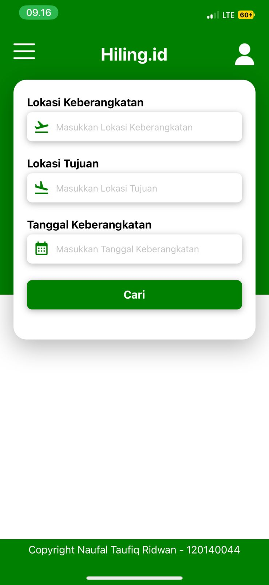
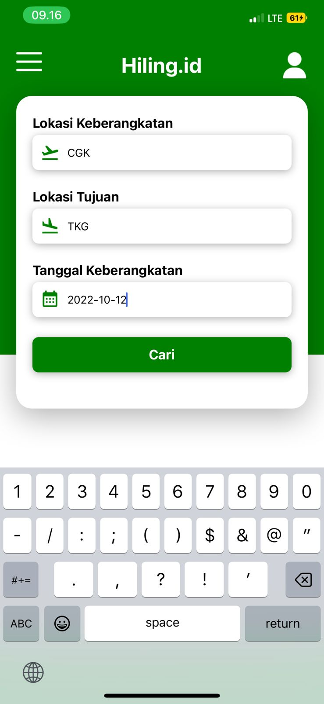

<center>
    <h1>Hiling.id</h1>
    <h3>Naufal Taufiq Ridwan - 120140044</h3>
</center>

## Screenshots
<center>
    
    
    
</center>

## Video
<center>
    <video src="docs/demo.mp4" width="30%" controls></video>
</center>

## How to run
1. Clone this repository
    ```bash
    git clone https://github.com/n0l3r/PAM-Tugas-Individu-3.git
    ```
2. Install dependencies
    ```bash
    npm install
    ```
3. Run the app
    ```bash
    npm start
    ```
4. Open the app on expo client with the QR code

## How to build
1. Clone this repository
    ```bash
    git clone
    ```
2. Install dependencies
    ```bash
    npm install
    ```
3. Build the app
    ```bash
    npm i -g eas-cli
    eas login
    eas build:configure
    eas build --platform all
    ```
4. Download the apk file


